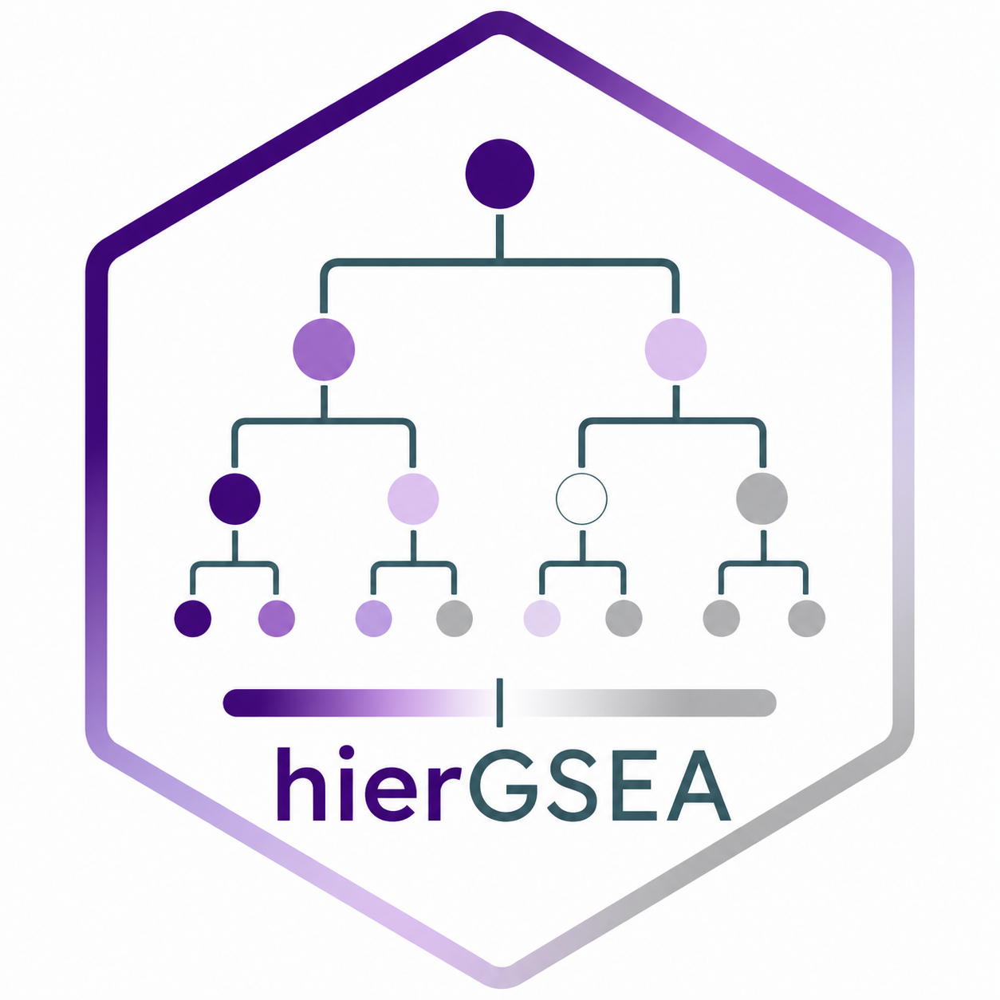

# hierGSEA

<p align="center">
  
</p>

<p align="center">
  <strong>Public beta:</strong> hierarchy-aware post-processing and visualization for GSEA outputs
</p>

`hierGSEA` is an R package for hierarchy-aware post-processing of GSEA outputs
generated upstream by `clusterProfiler`, `ReactomePA`, or
`clusterProfiler::GSEA()` with a hierarchical custom backend. The package keeps
the known ontology/pathway structure visible during filtering, multiple-testing
correction, ordering, and plotting.

It does **not** reimplement GSEA itself. Instead, it takes an existing
`gseaResult` and adds:

- hierarchy mapping onto Reactome, GO, or MitoCarta backends
- level-aware and branch-aware Benjamini-Hochberg correction
- significant-branch retention with ancestor preservation
- branch-first ordering where parents always precede descendants
- left-side hierarchy plotting directly in `ggplot2`

## What problem this solves

Flat pathway tables are convenient, but they ignore the fact that Reactome, GO,
and MitoCarta are structured databases. In practice that means:

- parent and child pathways are often interpreted side by side without context
- biologically unrelated branches are corrected together as one flat list
- figures need manual editing to restore the hierarchy visually

`hierGSEA` keeps the curated tree or DAG structure explicit during
post-processing, so the statistical summary and the final figure better match
how analysts actually read pathway biology.

## Installation

This repository is currently structured as a GitHub-first package rather than a
CRAN or Bioconductor release.

```r
# install.packages("remotes")
remotes::install_github("maxull/hierGSEA")
```

## Supported databases

- Reactome
- GO, handled as separate `BP`, `MF`, and `CC` ontologies
- MitoCarta, using the Broad `MitoPathways3.0` hierarchy through custom
  `clusterProfiler::GSEA()` mappings

For GO, the ontology container nodes such as `all`, `biological_process`,
`molecular_function`, and `cellular_component` are intentionally removed from
the visible/testing hierarchy. That means `level_top = 1` starts at real GO
branches rather than ontology headers.

## Recommended upstream GSEA settings

Because `hierGSEA` works *after* the enrichment run, broad parent pathways must
survive the original upstream GSEA call.

Recommended starting settings:

- `minGSSize = 5`
- `maxGSSize = 10000`
- `pvalueCutoff = 1`
- `pAdjustMethod = "none"`

`hierGSEA` recalculates the hierarchy-aware adjusted p-values from the raw
`pvalue` column, so the incoming global `p.adjust` column is retained only for
reference.

## Minimal workflow

```r
library(hierGSEA)
library(ReactomePA)

reactome_res <- ReactomePA::gsePathway(
  geneList = ranked_vector,
  organism = "human",
  minGSSize = 5,
  maxGSSize = 10000,
  pvalueCutoff = 1,
  pAdjustMethod = "none",
  verbose = FALSE
)

reactome_hier <- hier_gsea(
  result = reactome_res,
  db = "reactome",
  directional = "both",
  level_top = 1,
  level_bottom = 5,
  alpha = 0.05
)

reactome_plot <- plot_hier_gsea(
  x = reactome_hier,
  tree_width = 0.40,
  top_n_parents = 3
)
```

## MitoCarta custom GSEA workflow

For MitoCarta, enrichment still comes from `clusterProfiler::GSEA()`. The
hierarchical backend and custom term mappings come from `hierGSEA`:

```r
mitocarta_res <- clusterProfiler::GSEA(
  geneList = symbol_ranked_vector,
  TERM2GENE = hierGSEA::mitocarta_term2gene(),
  TERM2NAME = hierGSEA::mitocarta_term2name(),
  minGSSize = 5,
  maxGSSize = 10000,
  pvalueCutoff = 1,
  pAdjustMethod = "none",
  verbose = FALSE
)

mitocarta_hier <- hier_gsea(
  result = mitocarta_res,
  db = "mitocarta",
  directional = "both",
  level_top = 1,
  level_bottom = 3,
  alpha = 0.05
)
```

The current bundled MitoCarta backend exposes 3 visible hierarchy levels.

## Statistical logic in one paragraph

`hierGSEA` uses the raw upstream `pvalue` and recalculates Benjamini-Hochberg
adjusted p-values within visible hierarchy families. At the chosen
`level_top`, all visible starting-level terms are corrected together. At deeper
levels, direct visible siblings under the same canonical parent are corrected
together. This is appropriate when the interpretation target is explicitly
branch-aware rather than one single flat ranking across the full ontology. It
should therefore be described as a hierarchy-aware local-family correction
strategy rather than a one-shot ontology-wide global FDR procedure.

## Output object

`hier_gsea()` returns a `hier_gsea_result` object with:

- `result_raw`: original upstream `gseaResult`
- `results_tbl`: hierarchy-aware result table
- `hierarchy_tbl`: backend parent-child edges
- `paths_tbl`: backend root-to-node path metadata
- `plot_tbl`: plot-ready node and connector coordinates
- `meta`: processing settings, testing scope, and backend version metadata

See:

- `?hier_gsea_result`
- `vignette("output-object-reference", package = "hierGSEA")`

## Included examples

This repository includes:

- `inst/scripts/run_single_fiber_bulk_example.R`
- `inst/scripts/run_hirc_proteomics_example.R`
- `inst/scripts/build_pkgdown_site.R`

The single-fiber and HIRC scripts are chronological end-to-end examples for
testing and debugging.

## Documentation site

This package is set up for a `pkgdown` site. Once the package is installed with
the documentation dependencies:

```r
source("inst/scripts/build_pkgdown_site.R")
```

That will build a browsable website with:

- a landing page
- function reference pages
- long-form methods documentation
- a dedicated output-object reference article

Public site URL:

- <https://maxull.github.io/hierGSEA/>

The repository also now includes a GitHub Actions workflow that can build and
publish the pkgdown site automatically from `main` once GitHub Pages is enabled
for the repository.

## Updating backend snapshots

The package ships prebuilt hierarchy snapshots in `R/sysdata.rda`. To check the
official Reactome, GO, and MitoCarta releases online and rebuild the local
backend only when a newer release is available, run:

```r
update_backend_data()
```

If the local backend already matches the online release, the function reports
that it is up to date and skips rebuilding.
