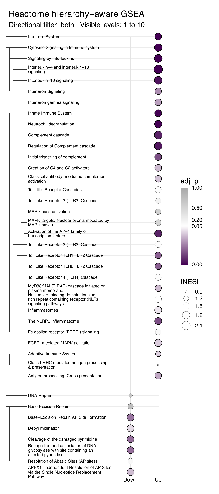
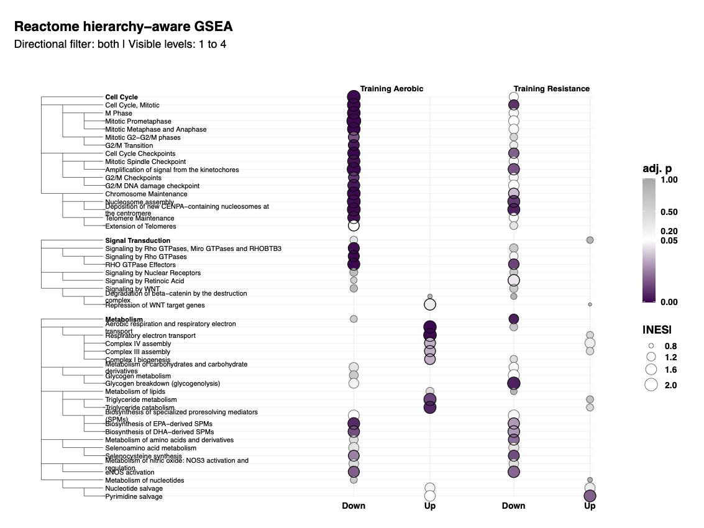
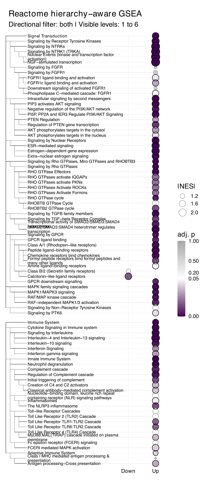
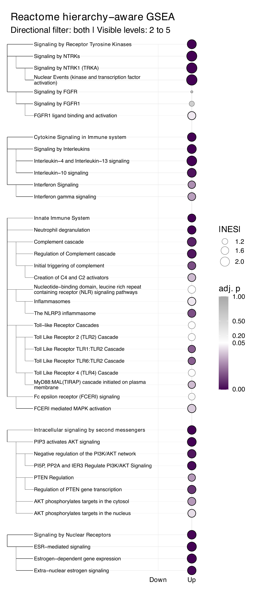
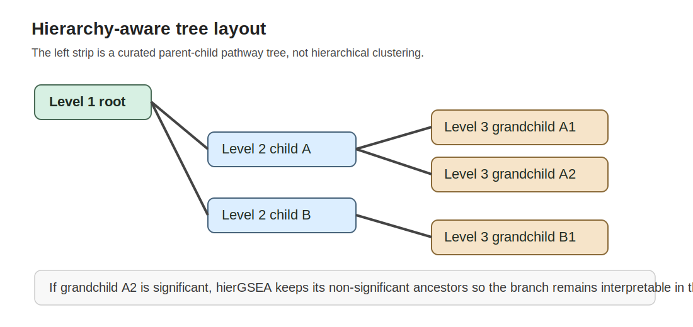

```{r, include = FALSE}
knitr::opts_chunk$set(
  collapse = TRUE,
  comment = "#>",
  eval = FALSE
)
```

# Overview

`hierGSEA` is designed for the stage *after* you already have a GSEA result
from `ReactomePA`, `clusterProfiler::gseGO()`, or
`clusterProfiler::GSEA()` with a hierarchical custom database such as
MitoCarta MitoPathways.

The package does **not** rerun enrichment or replace `clusterProfiler`.
Instead, it does four things on top of the upstream `gseaResult`:

1. maps tested terms onto a curated hierarchy backend
2. recalculates adjusted p-values within visible hierarchy families
3. retains significant branches together with the ancestors needed to show them
4. produces a hierarchy-aware dot plot with a left-side tree strip

## Recommended upstream settings

Large parent pathways are often removed before hierarchy-aware processing ever
starts. To avoid that, use permissive upstream GSEA settings whenever possible:

- `minGSSize = 5`
- `maxGSSize = 10000`
- `pvalueCutoff = 1`
- `pAdjustMethod = "none"`

`hierGSEA` recomputes the hierarchy-aware adjusted p-values from the raw
`pvalue` column, so the incoming global `p.adjust` column is preserved only for
reference.

# Supported backends

The current package supports:

- Reactome
- GO, handled separately as `BP`, `MF`, or `CC`
- MitoCarta via the Broad `MitoPathways3.0` hierarchy and custom
  `clusterProfiler::GSEA()` mappings

For GO, the artificial container nodes such as `all`,
`biological_process`, `molecular_function`, and `cellular_component` are
removed from the visible/testing hierarchy. That means level 1 in `hierGSEA`
starts at real biological branches rather than ontology headers.

# Standard workflow

## Step 1: run GSEA upstream

```{r}
library(ReactomePA)
library(clusterProfiler)
library(org.Hs.eg.db)

reactome_res <- ReactomePA::gsePathway(
  geneList = ranked_vector,
  organism = "human",
  minGSSize = 5,
  maxGSSize = 10000,
  pvalueCutoff = 1,
  pAdjustMethod = "none",
  verbose = FALSE
)

go_bp_res <- clusterProfiler::gseGO(
  geneList = ranked_vector,
  OrgDb = org.Hs.eg.db,
  keyType = "ENTREZID",
  ont = "BP",
  minGSSize = 5,
  maxGSSize = 10000,
  pvalueCutoff = 1,
  pAdjustMethod = "none",
  verbose = FALSE
)
```

## Step 2: process the hierarchy-aware view

```{r}
library(hierGSEA)

reactome_hier <- hier_gsea(
  result = reactome_res,
  db = "reactome",
  directional = "both",
  level_top = 1,
  level_bottom = 5,
  alpha = 0.05
)

go_bp_hier <- hier_gsea(
  result = go_bp_res,
  db = "go",
  ontology = "BP",
  directional = "up",
  level_top = 1,
  level_bottom = 5,
  alpha = 0.05
)
```

### Choose the visible hierarchy window before plotting

The two most important controls for avoiding a crowded output are:

- `level_top`: where the visible tree starts
- `level_bottom`: how deep the visible tree is allowed to go

For example, these two calls inspect the same Reactome result with different
windows:

```{r}
reactome_hier_top_level <- hier_gsea(
  result = reactome_res,
  db = "reactome",
  directional = "both",
  level_top = 1,
  level_bottom = 4
)

reactome_hier_mid_level <- hier_gsea(
  result = reactome_res,
  db = "reactome",
  directional = "both",
  level_top = 2,
  level_bottom = 5
)
```

In practice:

- decrease `level_bottom` when the plot becomes too dense
- increase `level_top` when you want to start from a more specific part of the hierarchy
- keep the upstream GSEA settings permissive so those higher-level parent terms still exist in the input

## Step 3: make the plot

```{r}
reactome_plot <- plot_hier_gsea(
  x = reactome_hier,
  tree_width = 0.40,
  top_n_parents = 3,
  significance_cutoff = 0.05
)
```



If `directional = "both"` was used in `hier_gsea()`, the plot keeps the sign of
the enrichment by separating points into `Down` and `Up` columns. The point
size defaults to `|NES|`, while the point fill encodes the hierarchy-aware
adjusted p-value.

## Step 4: plot multiple results on one shared tree

If you already processed several contrasts with the same backend and ontology,
you can pass them as a named list into `plot_hier_gsea()`. The plotting method
will build one shared hierarchy on the y axis and then lay each result out in
its own x-axis facet using the input-list order. The example below mirrors the
real four-result MetaMex workflow provided in
`inst/scripts/run_metamex_multi_result_example.R`.

```{r}
reactome_multi_plot <- plot_hier_gsea(
  x = list(
    "Training Aerobic \nHealthy" = chronic_healthy_lean_aerobic_hier,
    "Training Aerobic \nOverweight" = chronic_healthy_overweight_aerobic_hier,
    "Training Resistance \nHealthy" = chronic_healthy_lean_resistance_hier,
    "Training Resistance \nOverweight" = chronic_healthy_overweight_resistance_hier
  ),
  tree_width = 0.40,
  parent_terms = "Immune System",
  significance_cutoff = 0.05
)
```



This is usually the cleanest public-facing multi-result layout because you can
compare several contrasts without redrawing the pathway tree for each panel.
In this example, the branch selection is narrowed to `Immune System` so the
shared biology remains readable across all four conditions.

## Step 5: control how many branches are shown

This is the most important plotting section for everyday use. If you do not
limit the visible starting branches, GO in particular can become too crowded to
read.

### Main controls

- `tree_width`: width of the left-side hierarchy strip
- `top_n_parents`: keep only the top `n` starting-level branches after
  hierarchy-aware ordering
- `parent_terms`: manually choose which starting-level branches to display
- `significance_cutoff`: sets the visual midpoint of the fill scale and the
  significance outline threshold

### Use the top-ranked 2 to 3 branches

```{r}
reactome_plot_small <- plot_hier_gsea(
  x = reactome_hier,
  tree_width = 0.40,
  top_n_parents = 2,
  significance_cutoff = 0.05
)
```



### Manually choose named branches instead

If you already know which major biology you want to highlight, you can choose
starting-level branches by term label or term ID.

```{r}
reactome_plot_selected <- plot_hier_gsea(
  x = reactome_hier,
  tree_width = 0.45,
  parent_terms = c("Immune System", "Signal Transduction"),
  significance_cutoff = 0.05
)
```

`parent_terms` overrides `top_n_parents`, so you usually use one or the other.

### Practical rules of thumb

- start with `top_n_parents = 2` or `3`
- increase `tree_width` when the left-side tree looks cramped
- reduce `level_bottom` if long descendant stacks still make the plot too tall
- use `parent_terms` when a biologically targeted figure is more useful than a global summary

## Additional example views

The same underlying hierarchy-aware result can be visualised in different ways
depending on whether you want a broad summary or a more focused branch view.

### Top 2 starting-level Reactome branches

This example shows a more aggressively simplified overview where only the two
highest-priority starting branches are retained for plotting.

### Reactome view starting at level 2 and extending to level 5

This example shows a more specific hierarchy window, which is useful when the
level 1 branches are too broad and you want to start the interpretation deeper
in the pathway structure.

```{r}
reactome_plot_level_2_to_5 <- plot_hier_gsea(
  x = reactome_hier_mid_level,
  tree_width = 0.40,
  top_n_parents = 5,
  significance_cutoff = 0.05
)
```



# MitoCarta workflow

For MitoCarta, enrichment itself still comes from `clusterProfiler::GSEA()`.
`hierGSEA` supplies the hierarchy backend and the custom TERM2GENE/TERM2NAME
mappings:

```{r}
mitocarta_res <- clusterProfiler::GSEA(
  geneList = symbol_ranked_vector,
  TERM2GENE = hierGSEA::mitocarta_term2gene(),
  TERM2NAME = hierGSEA::mitocarta_term2name(),
  minGSSize = 5,
  maxGSSize = 10000,
  pvalueCutoff = 1,
  pAdjustMethod = "none",
  verbose = FALSE
)

mitocarta_hier <- hier_gsea(
  result = mitocarta_res,
  db = "mitocarta",
  directional = "both",
  level_top = 1,
  level_bottom = 3,
  alpha = 0.05
)
```

At the moment, the bundled MitoCarta backend exposes 3 visible hierarchy
levels.

# Visual summary

The hierarchy-aware plot is not a dendrogram or clustering result. It is a
database-driven parent-child tree that preserves known ontology structure.



# What to read next

- `vignette("methods-and-statistical-rationale", package = "hierGSEA")`
- `vignette("output-object-reference", package = "hierGSEA")`
- `?hier_gsea_result`
