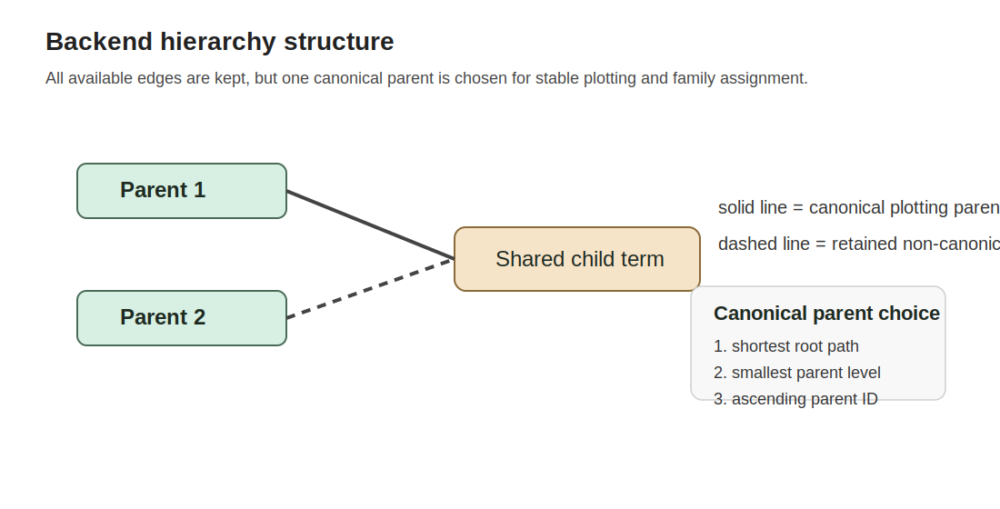
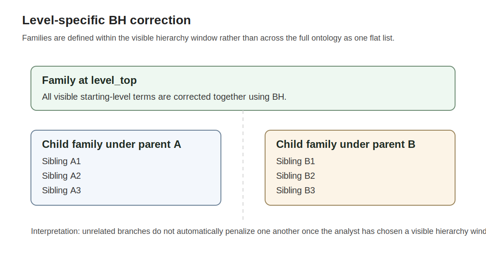

```{r, include = FALSE}
knitr::opts_chunk$set(
  collapse = TRUE,
  comment = "#>",
  eval = FALSE
)
```

# Why `hierGSEA` exists

Standard GSEA result tables are usually reported as flat ranked lists. That is
convenient, but it hides two important facts:

1. Reactome, GO, and MitoCarta pathways are not flat collections of unrelated terms.
2. Parent pathways and child pathways should not always be interpreted as if
   they were independent tests from the same family.

`hierGSEA` addresses that by post-processing the upstream `gseaResult` inside
the known database hierarchy rather than flattening everything into one table.

# Hierarchy mapping

The first step is to map each tested term onto a backend hierarchy.

- Reactome uses parent-child pathway relationships from the Reactome database.
- GO uses ontology relationships from `GO.db`, but removes the high-level
  container nodes so visible levels begin at real biological branches.
- MitoCarta uses the Broad `MitoPathways3.0` hierarchical pathway structure.

Each term receives:

- a visible hierarchy `level`
- a canonical `parent_id`
- a canonical root-to-node path
- all parent links for diagnostic completeness where the source ontology is a DAG

# Canonical parent choice in DAGs

GO and some Reactome terms can have more than one parent. `hierGSEA` keeps all
links in the backend, but chooses one deterministic canonical plotting parent
for branch assignment and visualization.

The canonical parent is selected by:

1. shortest path from a root
2. then smallest parent level
3. then ascending parent ID

This keeps the plotting layout stable and reproducible while preserving the
full edge set for diagnostics and future extensions.



# Directional filtering

Once hierarchy metadata have been attached, the visible table can be filtered
by enrichment direction:

- `"both"` keeps all mapped terms
- `"up"` keeps `NES > 0`
- `"down"` keeps `NES < 0`

This filter is applied *after* hierarchy annotation so level metadata remain
consistent with the backend.

# Visible level window

`level_top` and `level_bottom` define the hierarchy window you want to inspect.
`hierGSEA` trims the mapped result to that visible window before performing the
hierarchy-aware correction.

This matters because the package treats the visible branch families as the
interpretation scope. If you only want to inspect levels 2 to 5, then the
multiple-testing correction should match that scope rather than a different
implicit term universe.

# Level-specific BH correction

The hierarchy-aware adjusted p-value uses the upstream raw `pvalue`, not the
incoming global `p.adjust`.

The correction families are:

- at the starting level: all visible terms at `level_top`
- at deeper levels: the direct visible siblings under the same canonical parent

In other words, `hierGSEA` applies Benjamini-Hochberg within local hierarchy
families that match the branch structure being inspected.



## Why this is appropriate

This approach is appropriate when the scientific question is branch-aware
interpretation rather than one single global ranking across every tested term in
the ontology.

The rationale is:

1. sibling pathways compete for interpretation inside the same parent context
2. unrelated branches should not automatically penalize one another as if they
   were a single homogeneous hypothesis family
3. analysts usually inspect pathway results locally within major biological
   branches rather than as one fully exchangeable list

The method therefore aligns the multiple-testing scope with the biological
structure being visualized and interpreted.

## Important limitation

This is not the same claim as controlling one ontology-wide global FDR across
all tested terms simultaneously. `hierGSEA` should therefore be described as a
hierarchy-aware, branch-local post-processing strategy for interpretation and
visualization.

# Branch retention

After family-wise BH correction, `hierGSEA` keeps:

- all hierarchy-aware significant terms
- non-significant ancestors that are needed to connect significant descendants
  back to the visible root window

It drops non-significant branches that have no significant descendants.

That is why the final plot may include parent rows with `NES = NA` and
`term_in_input = FALSE`: those rows are structural anchors, not independently
significant hits.

# Branch ordering

The final display order is branch-aware rather than similarity-based.

Roots are ordered by:

1. best descendant `p_adjust_hier`
2. then largest descendant absolute `NES`
3. then term description

The same rule is applied recursively down the branch, while always placing the
parent before its descendants.

# Plot logic

The plot is built directly in `ggplot2` using:

- a compact left-side tree strip
- aligned term labels
- one or two dot columns depending on `directional`
- point size based on enrichment magnitude
- point fill based on hierarchy-aware adjusted p-value

The tree is therefore a direct rendering of the curated database hierarchy, not
hierarchical clustering.
