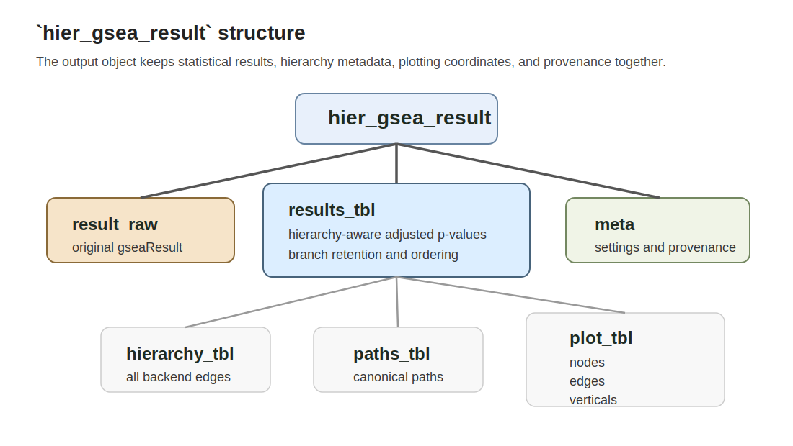

```{r, include = FALSE}
knitr::opts_chunk$set(
  collapse = TRUE,
  comment = "#>",
  eval = FALSE
)
```

# Overview

`hier_gsea()` returns an S3 object of class `hier_gsea_result`.

```{r}
reactome_hier <- hier_gsea(
  result = reactome_res,
  db = "reactome",
  directional = "both",
  level_top = 1,
  level_bottom = 5
)

class(reactome_hier)
str(reactome_hier, max.level = 1)
```

The object is meant to be used in two complementary ways:

- as a stable container for downstream inspection and export
- as the direct input to `plot_hier_gsea()`



# Top-level elements

## `result_raw`

The original `DOSE::gseaResult` object supplied to `hier_gsea()`.

Use this when you want to compare the hierarchy-aware output back to the
original flat enrichment result.

## `results_tbl`

This is the main table analysts will usually inspect and export.

It contains:

- original GSEA statistics carried through from the upstream result
- hierarchy metadata such as `level`, `parent_id`, and `canonical_path`
- hierarchy-aware testing columns such as `family_id`, `family_n_tested`,
  `p_adjust_hier`, and `is_significant_hier`
- branch-ordering columns such as `branch_best_p`, `branch_best_nes`, and
  `order_index`

### Important columns

| Column | Meaning |
|---|---|
| `term_id` | Backend identifier used for hierarchy mapping |
| `Description` | Term label used for printing and plotting |
| `NES` | Signed normalized enrichment score from upstream GSEA |
| `abs_NES` | Absolute normalized enrichment score |
| `pvalue` | Raw upstream GSEA p-value used for hierarchy-aware BH |
| `p.adjust` | Incoming upstream global adjusted p-value |
| `p_adjust_hier` | Hierarchy-aware adjusted p-value |
| `is_significant_hier` | `TRUE` when `p_adjust_hier < alpha` |
| `level` | Visible hierarchy level |
| `parent_id` | Canonical parent used for local-family correction and plotting |
| `canonical_path` | Canonical root-to-node lineage as a list column |
| `family_id` | Local testing family used for BH correction |
| `term_in_input` | Whether the row came from the original GSEA result |
| `order_index` | Final branch-preserving display order |

## `hierarchy_tbl`

This is the backend edge table. It is especially useful for diagnostics when
you want to inspect the raw parent-child structure independently of the
post-processed result table.

For GO, this table keeps all parent-child links even though plotting and family
assignment use only one canonical parent per term.

## `paths_tbl`

This table contains the precomputed root-to-node paths supplied by the backend.
It is the easiest place to inspect:

- canonical path strings
- term depth
- root assignment

## `plot_tbl`

`plot_tbl` is a list with three elements:

- `nodes`: one row per retained term with baseline plotting coordinates
- `edges`: parent-child horizontal connector segments
- `verticals`: vertical grouping segments joining sibling descendants

These are the raw coordinates used by `plot_hier_gsea()`. They are useful when
you want to debug ordering, spacing, or connector logic directly.

## `meta`

The `meta` list stores the settings and data provenance that are needed to
reproduce the hierarchy-aware processing:

- `db`
- `ontology`
- `directional`
- `level_top`
- `level_bottom`
- `alpha`
- `correction_method`
- `recommended_upstream_gsea_args`
- `testing_scope_tbl`
- `backend_metadata`

### `testing_scope_tbl`

This is the pre-pruning visible testing table used for hierarchy-aware BH
recalculation. It is particularly important for method checks and debugging,
because it shows the exact term families that were corrected before ancestor
retention.

# Practical inspection patterns

## Inspect the main ordered result

```{r}
reactome_hier$results_tbl
```

## Export the hierarchy-aware table

```{r}
readr::write_csv(
  reactome_hier$results_tbl,
  "reactome_hierarchy_results.csv"
)
```

## Inspect the testing family sizes

```{r}
reactome_hier$meta$testing_scope_tbl |>
  dplyr::count(family_id, family_n_tested)
```

## Inspect retained structural ancestors

```{r}
reactome_hier$results_tbl |>
  dplyr::filter(!term_in_input)
```

# Formal reference

For the concise object help page, see `?hier_gsea_result`.
